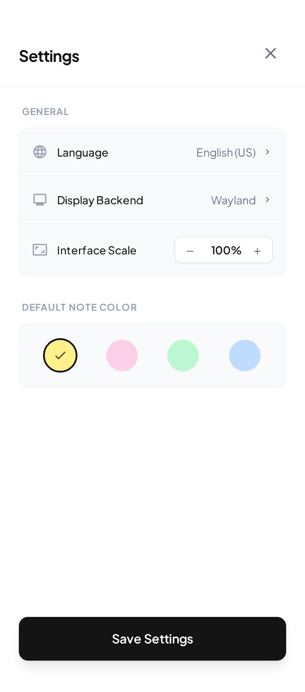

# StickyNotes

A modern, high-performance sticky notes application for Linux (Wayland & X11) and Windows. Built with **Rust**, **Tauri v2**, and a polished **Vanilla JS/Tailwind** frontend.


## Features

- **Modern Design**: Frameless, transparent window with rounded corners and blur effects.
- **Desktop Integration**: Minimal footprint, behaves like a native widget.
- **Rich Text Support**: Create and edit notes with ease.
- **Organization**:
  - Sort by Grid or List view.
  - Search and filter notes instantly.
  - Color-code notes for better organization.
- **Cross-Platform**: Runs smoothly on Linux and Windows.

## Gallery

### Task Management

Stay organized with clear, readable lists.


### Customization

Personalize your experience with settings.


## Quick Start

### 1. Install Dependencies (Ubuntu/Debian)

```bash
sudo apt update
sudo apt install libwebkit2gtk-4.1-dev build-essential curl wget file libxdo-dev libssl-dev libayatana-appindicator3-dev librsvg2-dev
```

### 2. Run in Development Mode

```bash
npm install
npm run tauri dev
```

### 3. Build for Production

```bash
npm run tauri build
```

The executable will be in `src-tauri/target/release/bundle/deb/` (or other format depending on your OS).

## Tech Stack

- **Backend**: Rust (Tauri)
- **Frontend**: HTML, JavaScript, Tailwind CSS
- **Icons**: Material Icons Round
